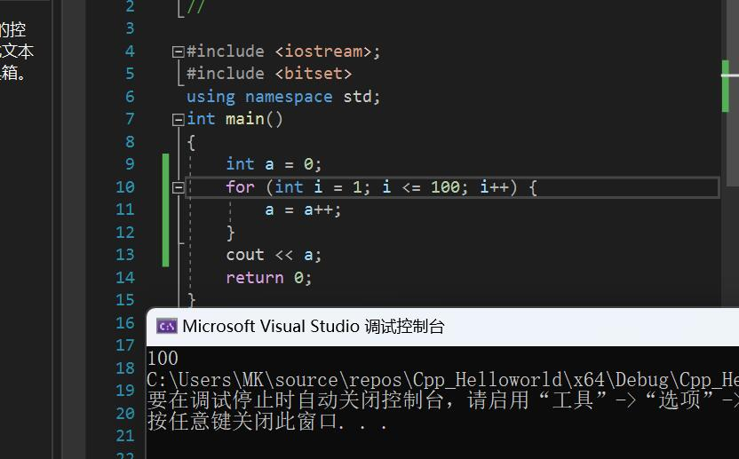
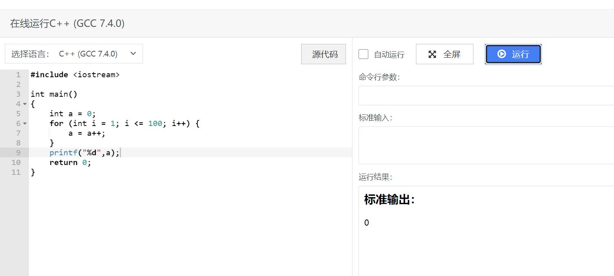

# 编译相关

## Q：为什么要写using namesapce std；

C++的STL都是定义在std命名空间中的， using namespace语句的作用是提前声明要引 用的命名空间，这样引用命名空间中的名称时就不用加命名空间前缀。 例如，如果不写using namespace std的话，在引用cin的时候，就要写成std::cin。（刘舒畅 倪士平）

## Q：为什么要写xxxx头文件

你所使用的某个函数或某个类在xxxx头文件中声明的，有时候你不写也能用的原因可能是已经写明的头文件中交叉引用了xxx头文件。

（ by 倪士平）

## Q：expected declaration or statement at end of input

1\. 某一个函数或者变量没有在使用之前声明。

2\. 某个地方少了个括号。（并不一定是编译器指出错误的地方，这种情况，编译器一般会在最后一行代码报错，但错误很可能不在最后一行，要靠自己去找出来

（ by 倪士平）

## Q：“LNK1168无法打开xxx文件进行写入”

与已经执行的任务冲突，检查一下是否已经打开了一个调试窗口，或存在其他程序打开了xxx文件

（ by 倪士平 刘舒畅）

## Q："无法启动程序‘xxx.exe’系统找不到指定文件"

检查你的代码文件是否在项目的“源代码”文件夹下，检查的方法就是看VS右侧“解决方案资源管理器”

找不到则在“视图”下查找，点击“解决方案资源管理器”后将出现在屏幕右侧。

<figure><figcaption></figcaption></figure>

（ by 倪士平）

## Q："mingw-w64-crt/crt/crt0\_c.c:18: undefined reference to 'WinMain' "

检查一下你的main打对了没有。

（by 倪士平）

## Q：为什么同一份代码使用两种编译器的结果会不一样？

| clang                              | gcc                                |
| ---------------------------------- | ---------------------------------- |
|  |  |

这里使用了一个可能没有被C++语言规范 规定的语句： a=a++。这里产生一个问题，是赋原来的a，还是赋加之后的a。你使用的VS使用的底层编译器是clang，而你使用的在线IDE的编译器是gcc，两者对这一语句做出不同的判断。

（by 刘舒畅 倪士平）

## Q：在包含头文件时，报错提示No such file or directory

有以下几种原因：

1. 命名时或者包含头文件时名字打错了
2. 没有指明包含文件的路径或者没有把头文件放在同一个文件夹下

（by 倪士平）

## Q：NK2019 无法解析的外部符号 \_main

详细信息： 错误 LNK2019 无法解析的外部符号 \_main，该符号在函数 "int \_\_cdecl invoke\_main(void)" (?invoke\_main@@YAHXZ) 中被引用 Integral C:\Users\DELL\source\repos\Integral\MSVCRTD.lib(exe\_main.obj) 1

简解： 出错原因是当前操作的Cpp工程/项目（Cpp project）中，没有任何一个\*.cpp源代码文件中正确书写了main函数（回顾第一课：如果希望编译出可执行程序，则必须书写main函数）。

初学阶段往往一个Cpp工程/项目只包含一个\*.cpp源代码文件，此时出错原因即为**该\*.cpp源代码文件中没有正确书写main函数**。进一步的，可能的书写错误包括：

1. 单词int或单词main拼写错误，例如拼写为mian；
2. 单词int或单词main错用大写字母，例如拼写为Main（回顾课堂示例）；
3. 99999

此时应**仔细检查所写cpp源代码文件**，确认所犯错误是以上哪一种。

（by 郭淳）
