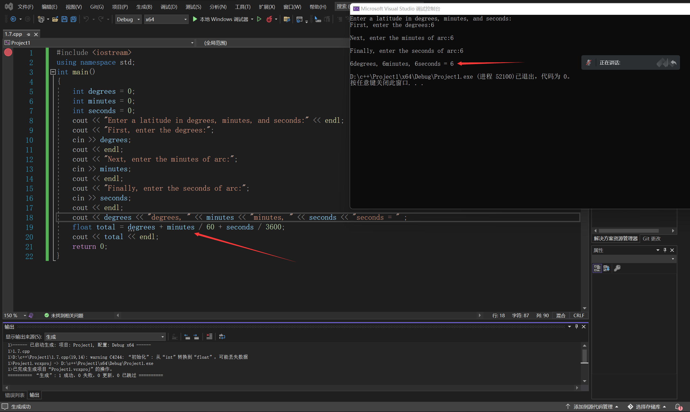

# 输入输出及运算相关

## Q：'\x40'，'\n'都是什么?

`\`表示对后面紧跟着的字符进行转义。如`\x40`是`@`，`@`的Ascii码值就是40，`\n`是换行符。

转义是值使得某个字符序列具有不同于该字符序列单独出现时的语义，转义字符的两个功能分别是：一，表示设备命令或者无法被字母表直接表示的特殊数据；二，字符引用，用于表示无法在当前上下文中被键盘录入的字符（如字符串中的回车符），或者在当前上下文中会有不期望的含义的字符（如C语言字符串中的双引号字符"，不能直接出现，必须用转义序列表示）

## Q：可以使得输入在不换行的情况下停止吗？

不可以，换行是输入结束的标志

（by 刘舒畅）

## Q：为什么cout<<"字符串"、cout<<\&a的结果不同？进一步的，用取址运算符取出a的地址后，假如是0x61feec，再cout<<0x61feec，为什么结果打印出来又是整数而非a的值？

简言之，出现上述现象的原因是"cout <<"语句输出的特性取决于其中运算符<<右侧的操作数类型。针对以下三种操作数类型，其默认输出效果不同：

1. cout << 字符数组/字符指针/字符变量地址：此时默认输出字符数组中存储的字符串/字符指针指向的字符串/以字符变量地址为起始地址的内存片段中存储的字符串（注意区分概念“字符串”与“字符数组”）
2. cout << 之后的操作数是其它类型变量的数组/指针变量：此时默认输出十六进制表示的数组内存起始地址值/指针变量存储的地址值
3. cout << 之后的操作数是写入程序代码的十六进制数值：此时默认以十进制方式输出所指定的十六进制整数

cout是一种C++对象，上述特性体现了C++对象的多态性。用C语言可以实现类似的特性，但或须在C代码中进行频繁的显式类型转换，或须通过额外参数明确指定操作数类型，不能完全达到C++代码“以不变应万变”的效果。

上述现象的深层原理是C++运算符重载机制。语句"cout << 操作数"实质是调用运算符重载函数ostream& operator<<(ostream& os, type x)，其中第一实参为cout，第二实参为操作数。

C++库文件自带上述运算符重载函数operator<<的一系列形参类型不同的重载：

1. ostream& operator<<(ostream& os, const char \*s)
2. ostream& operator<<(ostream& os, const int \*s)
3. ostream& operator<<(ostream& os, const long \*s) // 及其它类似定义
4. ostream& operator<<(ostream& os, const int x)
5. ostream& operator<<(ostream& os, const long x) // 及其它类似定义

在编译阶段，编译器根据实参"操作数"判断实际调用的重载函数，进行针对性的处理。因此，

1. 将语句"cout << 字符数组str/字符指针str"编译为重载函数ostream& operator<<(ostream& os, const char \*s)的调用operator<<(cout, str)，该重载函数调用功能是输出字符数组str中存储的字符串/字符指针str指向的字符串；
2. 将语句"cout << 整型数组p/整型指针p"编译为重载函数ostream& operator<<(ostream& os, const int \*s)的调用operator<<(cout, p)，该重载函数调用功能是输出十六进制表示的整型数组p内存起始地址值/整型指针p存储的地址值。以其它非字符型数组/指针为操作数的cout语句编译和功能与此类似。
3. 将语句"cout << 0x61feec"编译为重载函数ostream& operator<<(ostream& os, const int x)的调用operator<<(cout, 0x61feec)，该重载函数调用功能近似于将十六进制整数0x61feec转换为十进制，再输出。注意直接写入代码的0x61feec是十六进制表示的整型字面常量，默认情形下并不会被识别为内存地址值。

（by 郭淳）

## Q：如何输入输出汉字

首先请阅读[计算机基础知识1.1节](../useful-cs-knowledge/1.1-xin-xi-zai-ji-suan-ji-zhong-de-biao-shi.md#bian-ma)中编码相关内容，了解汉字如何在计算机中存储，汉字的编码）问题。

### wchar\_t

类似char，在C++中存在双字节字符类型wchar\_t，分给单个字符的存储空间更大，单个wchar\_t 型变量还是一个字符型变量。例如，定义wchar\_t c = '好'是合法的，但wchar\_t c = 'ABC'则不合法，宽字符不等于字符串。

```cpp
// wchat_t.cpp
#include<iostream>
#include<clocale>
using namespace std;
int main()
{
    //使用setlocale函数将本机的语言设置为中文简体
    setlocale(LC_ALL, "chs");//LC_ALL表示设置所有的选项（包括金融货币、小数点，时间日期格式、语言字符串的使用习惯等），chs表示中文简体
    wchar_t wt[] = L"汉字输出测试";//大写字母L告诉编译器为"中"字分配两个字节的空间
    wcout << wt << endl;//使用wcout来代替cout输出宽字符，wcin类代替cin输入宽字符
    cout << wcslen(wt) << endl;//wcslen输出宽字符串的长度，输出长度是5
    cout << sizeof(wt) << endl;//输出长度是12个字节，最后的wchar_t类型的'\0'两个字节
    return 0;
}
```

上述代码在DevC++中直接运行会报错，原因在于编译器中编译选项对字符集配置存在问题，此处不做深究，有意愿的同学自行研究。

### string

string类是不定长度的，可以处理汉字这样的多字节编码的字符，需注意这里需要引入`#include<string>`，这个头文件中声明了string类和相关的方法,不同于`#include<cstring>`中对char数组的各种操作。

```
// wchat_t.cpp
#include<iostream>
#include<string>
using namespace std;
int main()
{
	string example="汉字输出测试";
	cout << example;
	return 0;
}
```

（ by 倪士平）

## Q：VScode输出汉字出现乱码

造成该问题的本质在于，vscode默认使用的是UTF-8,而Windows系统默认的编码则是GBK（也是cmd所使用的代码页），两者在字符的二进制指示上有很大区别，在运行过程中才会出现乱码。关于编码相关知识见1[.1节编码部分](../useful-cs-knowledge/1.1-xin-xi-zai-ji-suan-ji-zhong-de-biao-shi.md#bian-ma)

修改VScode的方法见[博客](https://blog.csdn.net/weixin\_46595440/article/details/125267724)

（by 倪士平 陈欣宇）

## Q：cout>>"hello">>"word"的输出为什么没有空格

空格也是字符，Ascii码值为32。在合适的位置添加即可。

（ by 倪士平）

## Q:为什么我打印某个由我自己创建的变量的时候，得到了类似大随机数的效果？

没有对变量定义初始值，此时输出的值的内容无法预料（可能是之前某个进程在使用内存过后留下的残留，）

PS:不同类型的文件储存在计算机中都是一组带有特定格式的二进制码，文件类型（后缀名），只是用来告知计算机用何种规则去解释这组0/1串。同样的道理也可以应用于cpp的实际编程中， 同一处变量空间，用不同的规则（变量类型）去解释，会得到不用的数据。

（by Trace AJ）

## Q：如何查看符号位？

根据[有符号整数](../useful-cs-knowledge/1.1-xin-xi-zai-ji-suan-ji-zhong-de-biao-shi.md#you-fu-hao-shu-de-biao-shi)和[浮点数](../useful-cs-knowledge/1.1-xin-xi-zai-ji-suan-ji-zhong-de-biao-shi.md#fu-dian-shu-de-biao-shi)的相关知识，我们只需要将变量以二进制输出看第一位就行。下面给出了一个在C++中以不同形式输出整数的方法：

```cpp
#include <iostream>
#include <bitset> //输出二进制的头文件
using namespace std;
 
int main(){
	int a = -12333;
	cout << "八进制： " << oct << a << endl;
	cout << "十进制： " << dec << a << endl;
	cout << "十六进制： " << hex << a << endl;
	cout << "二进制： " << bitset<sizeof(a)*8>(a) << endl;
	return 0;
}
```

（by 刘舒畅 倪士平）

## Q：为什么表达式算出来不对/是小数？

很可能藏着数据类型的转换，C++中存在一些隐式的类型转换规则，在编码时需要注意。下面给出一些例子：

<figure><figcaption></figcaption></figure>

这里`minutes`变量为int类型，除以整数所得结果仍为int。若想得到小数，至少使得参与运算的其中一个变量为浮点型。可将`minutes`定义为浮点型，或将`/60`改为`/60.0`。

（by 刘舒畅 倪士平）

## Q：为什么会有`warning C4305：“初始化”：从“double”到“float”截断`这样的警告？

在类型转换中，由于float和double类型的精度不同，因而double的数据不能完全存入float中，会从数据尾舍掉存储不下的部分。

（by 刘舒畅 倪士平）

## Q：如果我想要让两个整型变量相除的小数结果，要怎么做呢？

可通过强制类型转换将其中一方转换为浮点型。例：

```
int a=1,b=2; 
cout<<(double)a/b;
```

但要注意，类似`(double)(a/b)`的语句会将`(a/b)`这个整型数据转换为浮点型，而不会保留小数。

（by 刘舒畅 倪士平）

## Q：为什么这个表达式的运算结果不对

有以下几种原因：

1. 参与运算或者保存结果的**变量类型错误**
2. 使用了错误的函数或者运算符
   1. `||`是逻辑运算符，而\`|\`是与运算符
   2. \`^\`不是平方而是异或
3. 由于运算符优先级导致的问题

（by 倪士平 刘舒畅）

## Q：`++i`与`i++`的区别？

`++i`先令`i`自加一，然后返回`i`的值；`i++`则是先返回再自加一。例如下面的语句：

```cpp
int i = 1;
int k = i++;
i = 1;
int j = ++i;
```

在这个例子中，`k=1`，`j=2`。

（by 刘舒畅）

## Q：为什么`0<a<10`不发挥作用？

`0<a<10`在实际运行时，`0<a`会正常判断，但被判断`<10`的部分是`0<a`的返回值，而不是`a`。如果想实现数学上的判断，应当写成类似`0<a&&a<10`的形式。

（by 刘舒畅）

## Q：为什么字符串数组就能使用cout直接打印出来，而int型数组不行？

有趣的问题。iostream自带了针对char\*和string的重载operator<<定义，所以可以直接打印。

（by 刘舒畅）

