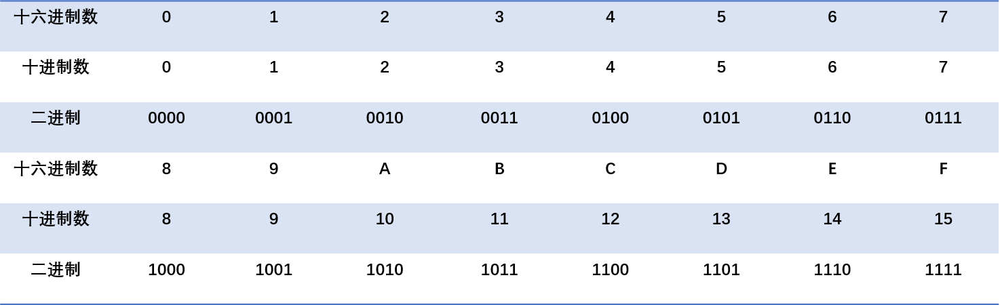
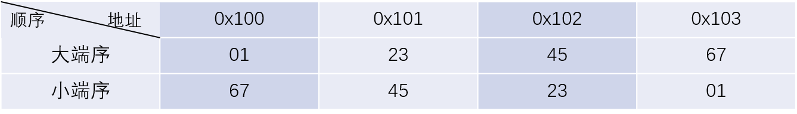
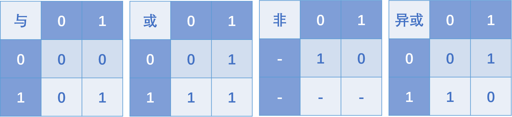
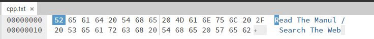

# 1.1 信息在计算机中的表示

在这一章中我们希望直观的向各位展示数据如何在计算机中表示的，同学们可以手动复现一下相关代码。

## 进制

众所周知，计算机以二进制的方式存储数据，二进制中每一位只有0和1两种可能的值，相信各位同学在高中阶段已经了解进制的概念了（关于基数与位权的一些概念，想重温这部分知识推荐阅读《编码:隐匿在计算机软硬件背后的语言》第七、八章）。

大多数计算机使用字节（也就是8位或8bit）为最小的可寻址内存单位，而不是单独的位。

一个字节由八位组成，则它的值域为$$00000000_2\sim11111111_2$$，如果看成十进制值域就是$$0_{10}\sim 255_{10}$$

可以发现用二进制表示数据是很麻烦的，譬如想表示十进制整数$$214_{10}$$至少也需写成$$11100000_2$$，于是我们通常使用十六进制进行表示，十六进制与二进制转换如下表所示。



所以我们通常使用两个十六进制数表示一个字节的信息，取值范围为$$0x00\sim 0xFF$$

在本版块你需要掌握什么？二进制、十进制、十六进制之间的快速相互转换。

## 字节序

计算机以字节为单位，那么对于跨字节的对象就存在字节的存储顺序的规则，主要分为两类，一类是小端序（Little endian），另一类是大端序（Big endian）。

考虑一个多字节的对象$$t = a_na_{n-1}a_{n-2}....a_2a_1a_0$$，$$a_i$$表示某一bit，我们记$$a_0$$为最低有效位，$$a_n$$为最高有效位，由此也可推出最高有效字节为$$a_na_{n-1}a_{n-2}a_{n-3}a_{n-4}a_{n-5}a_{n-6}a_{n-7}$$，最低有效字节为$$a_7a_6a_5a_4a_3a_2a_1a_0$$。

我们称**按照从最低有效字节到最高有效字节的顺序存储的方式为“小端序”，从最高有效字节到最低有效字节的顺序存储的方式为“大端序”**，整数0x01234567的存储示例如下所示。



你可以通过下面这个示例代码体验这个过程，如你所知的那样char的大小恰好为一个字节，本实验中涉及了一些指针的用法，请查阅教材4.7节相关内容。

```
//byte.cpp
#include<cstdio>
using namespace std;

char a = 'A';
int b = 0x12345678;
char c[] = "abcd";
short d[] = {0x1234,0x5678};

int main(){
	printf("%x\n",a);
    for(int i = 0;i < 4;i++){
        printf("%x ",*((char*)&b+i));
    }
    printf("\n");
    for(int i = 0;i < 4;i++){
        printf("%x ",c[i]);
    }
    printf("\n");
    for(int i = 0;i < 4;i++){
        printf("%x ",*((char*)&d+i));
    }
    printf("\n");
    return 0;
}
```

```
>>> g++ byte.cpp -o byte.out
>>> ./byte.out
41
78 56 34 12 
61 62 63 64 
34 12 78 56 
```

当数据为单一字节是，无论是大端序还是小端序保存，字节的存储都是一样的，对于多字节数据，大端序和小端序的会导致不同存储顺序。而**字符串是存储在字符数组中，数组是连续存储的，所以在字符数组无论是按照大端序还是小端序存储，存储的结果是一致的**。

除了上述实验的方法验证大端序和小端序，使用十六进制查看器也可以验证，但是我们将“在十六进制查看器打开文件”这一节具体介绍该方法。

在CSAPP中给出了一个鲁棒性更好的打印程序对象字节表示的代码，你可以根据该代码设计代码探索其他类型数据在计算机中的存储。

```
typedef unsigned char *byte_pointer;

void show_bytes(byte_pointer start, size_t len){
	size_t i;
	for(int i = 0;i < len; i++)
		printf("%.2x", start[i]);
	printf("\n");
}

void show_int(int x){
    show_bytes((byte_pointer) &x, sizeof(int));
}
```

## C/C++中的一些运算

> 本节根据《深入理解计算机系统（第三版）》编写

### 布尔代数

二进制值是计算机编码、存储和操作信息的核心，所以围绕数值0和1的研究已经演化出了丰富的数学知识体系。这起源于1850年前后乔治●布尔(George Boole, 1815- 1864) 的工作，因此也称为布尔代数(Booleanalgebra)。布尔注意到通过将逻辑值TRUE(真)和FALSE(假)编码为二进制值1和0，能够设计出一种代数，以研究逻辑推理的基本原则。

**布尔代数在二元集合{0,1}上定义，定义了与(AND)、或(OR)、非(NOT)、和异或(EXCLLUSIVE-OR)几种运算**，运算规则如下表所示（二进制0和1表示逻辑值True和False）。



布尔运算应用于最早应用于命题逻辑，与运算中当两个逻辑值同时为真时结果为真；或运算中两个逻辑值至少有一个为真时结果为真；非运算是单目运算操作数为真则结果为假，操作数为假则结果为真；异或运算中两个逻辑值相同则结果为假，两个逻辑值不同则结果为真。

更多知识见离散数学或数字逻辑相关教材。

后来创立信息论领域的ClaudeShannon(1916--2001)首先建立了布尔代数和数字逻辑之间的联系。他在1937年的硕士论文中表明了布尔代数可以用来设计和分析机电继电器网络。尽管那时计算机技术已经取得了相当的发展，但是布尔代数仍然在数字系统的设计和分析中扮演着重要的角色。

现在我们将以上四个布尔运算拓展到位向量的运算，**位向量就是固定长度为w，由0和1组成的串**，位向量的运算定义为串中对应位置预算之间的运算。

假设a和b分别表示位运算$$[a_{w-1},a_{w-2},...,a_0]$$和$$[b_{w-1},b_{w-2},...,b_0]$$。

我们将$$a\&b$$定义为一个长度为$$w$$的位向量，其中第i个元素等于$$a_i\&b_i$$,以此类推。

假设$$a=[0110],b=[1100]$$，则有

$$a\&b=[0100]\\a|b=[1110]\\ \lnot a= [1001]\\a \oplus b =[1010]$$

### 位运算

C/C++语言的一个很有用的特性就是它支持按位布尔运算。事实上，我们在布尔运算中使用的那些符号就是C语言所使用的：|就是OR(或)，&就是AND(与)，\~就是NOT(取反)，而^就是EXCLUSIVE-OR(异或)。这些运算能运用到任何“整型”的数据类型上。

```
#include<cstdio>

int main(){
	using namespace std;
	int a = 0x41,b = 0x55;
	
    printf("a and b = %x\n a or b = %x\n ~a = %x\n a xor b = %x",a&b,a|b,~a,a^b);
    
    return 0;
}

/*控制台输出
a and b = 41
a or b = 55
~a = ffffffbe
a xor b = 14
*/
```

位级运算的一个常见用法就是实现掩码运算，这里掩码是一个位模式，表示从一个字中选出的位的集合。让我们来看一个例子，掩码0xFF(最低的8位为1)表示一个字的低位字节。位级运算x\&OxFF生成一个由x的最低有效字节组成的值，而其他的字节就被置为0。比如，对于x= 0x89ABCDEF, 其表达式将得到0x00000EF。表达式\~0将生成一个全1的掩码，不管机器的字大小是多少。尽管对于一个32位机器来说，同样的掩码可以写成0xFFFFFFF，但是这样的代码不是可移植的。

### 逻辑运算

C/C++提供了一组逻辑运算符||，&&，!，分别对应于命题逻辑中的OR，AND，NOT运算。

注意，**逻辑运算于位运算是不同的**，逻辑运算的**结果只有TRUE(1)或FALSE(0)**。

| 表达式          | 结果   |
| ------------ | ---- |
| !0x41        | 0x00 |
| !0x00        | 0x01 |
| !!0x41       | 0x01 |
| 0x64&&0x55   | 0x01 |
| 0x64\|\|0x55 | 0x01 |

逻辑运算符8.&和II与它们对应的位级运算&和|之间第二个重要的区别是，**惰性求值，如果对** **第一个参数求值就能确定表达式的结果，那么逻辑运算符就不会对第二个参数求值**。因此， 例如，当a=0时表达式a&&5/a将不会造成被零除，而表达式p&&\*p++也不会导致间接引用空指针。

### 移位运算

C/C++语言还提供了一组移位运算，向左或者向右移动位模式。对于一个位表示为$$[a_{w-1},a_{w-2},...,a_0]$$的操作数x，表达式x<\<k会生成一个值，其位表示为$$[a_{w-k-1},a_{w-k-2},...，0,0]$$。也就是说，x向左移动k位，丢弃最高的k位，并在右端补k个0。移位量应该是一个0\~w-1之间的值。移位运算是从左至右可结合的，所以x<\<j<\<k等价于(x<\<j)<\<k。 有一个相应的右移运算x>>k， 但是它的行为有点微妙。一般而言，机器支持两种形式的右移:逻辑右移和算术右移。逻辑右移在左端补k个0，得到的结果是\[0，.，0,工w-1，xu-2，.. xn]。算术右移是在左端补k个最高有效位的值，得到的结果是\[xw-1, ...xw-1，xw-1, xw-2, .，. x]。这种做法看上去可能有点奇特，但是我们会发现它对有符号整数数据的运算非常有用。 让我们来看一个例子，下面的表给出了对一个8位参数x的两个不同的值做不同的移 位操作得到的结果:

| 操作         | 值                           |
| ---------- | --------------------------- |
| x          | \[01100011] \[10010101]     |
| x << 4     | \[0011_0000_] \[0101_0000_] |
| x >> 4(逻辑) | \[_0000_0110] \[_0000_1001] |
| x >> 4(算数) | \[_0000_0110] \[_1111_1001] |

斜体的数字表示的是最右端(左移)或最左端(右移)填充的值。可以看到除了一个条目之外，其他的都包含填充0。唯一的例外是算术右移\[10010101]的情况。因为操作数的最高位是1，填充的值就是1。

C语言标准并没有明确定义对于有符号数应该使用哪种类型的右移——算术右移或逻辑右移都可以。不幸地，这就意味着任何假设一种或者另一种右移形式的代码都可能会遇到可移植性问题。然而，实际上，几乎所有的[编译器](1.2-cong-c++-dai-ma-dao-er-jin-zhi-cheng-xu.md)都对有符号数使用算术右移，且许多程序员也都假设机器会使用这种右移。另一方面，对于无符号数，右移必须是逻辑的。

## 浮点数的表示

## 溢出问题初探

## 在十六进制查看器打开文件

为了方便同学们动手实践，我们使用了一款基于网页的十六进制编辑器[HexEd.it](https://hexed.it/)，感谢Jens Duttjke开发了这样有用的工具，并感谢以及提供汉化的志愿者们。

这里我们把文件分为文本文件和其他文件。

### 文本文件

首先我们用记事本编写一个文本文件。


我们用HexEd打开它看一看。



可以看到是我们输入的文字所对应的ASCII码。你一定想到了，文本文件的存储方式就是存储字符的编码。如果输入的是汉字，那你会看到什么呢？动手试一试。

### 图片文件

这里我们再打开了一个png文件（实际上就是本章在进制一节所使用的图），你可以随意找到一些png图片打开，它们大致都是这个样子的。


在上图中，我用红色标出了两个位置，一个是PNG，一个是IHDR，前者是这个文件的一个文件头部标识，对于一个PNG文件来说，其文件头总是由`89504e470d0a1a0a`这样固定的字节来开始的，其中第一个字节0x89超出了ASCII字符的范围，这是为了避免某些软件将PNG文件当做文本文件来处理；后者其实是数据块开始的标识，表示后面是一个IHDR块。当你看到文件的末尾时，你也能看到`IEND`这是PNG文件的结束标志。

PNG图片的一般结构如下：


事实上除文本文件（或叫ASCII文件）都是采取类似的模式，即一个一个块构成。在文件的第一个数据块中会提供对该文件的一些描述，对于PNG图片而言包含图片的长宽、颜色模式等等，在[便携式网络图形 (PNG) 规范](http://www.libpng.org/pub/png/spec/)中你可以了解更多。

### 总结

计算机中的文件是以二进制存储的，它们通常具有一定的格式，这种格式便于程序对文件进行读写。

请读者探索一下问题：

1. 比较zip压缩文件和.docx文档文件
2. 尝试在十六进制编辑器中修改png图片的高和宽，看一看会发生什么。
3. 尝试在文件结尾加上一些数据，看看会怎么样，想一想为什么。

## 编码
