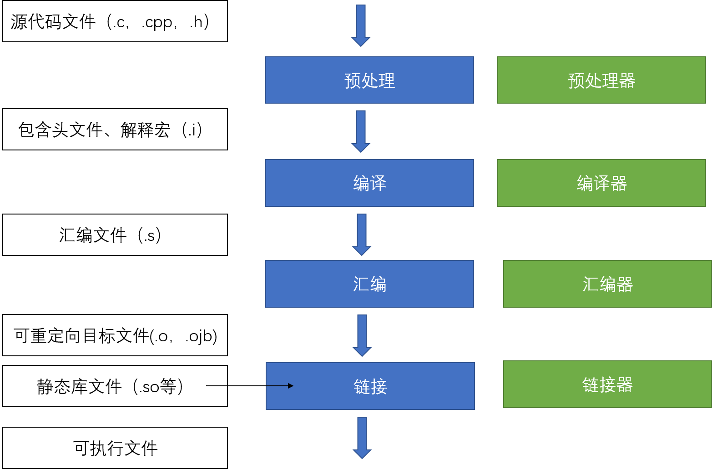

# 1.2 从C++代码到二进制程序

在集成开发环境中程序的生成总是一气呵成的，我们很少关注到其中具体的细节，为了帮助能同学遇到报错更好的解决问题，我们将简单介绍程序的生成过程。在本章中我们将以经典的`hello world`程序为例演示生成的完整过程。

我所使用的环境为，WSL2 + Ubuntu20.04 + g++

> WSL是适用于 Linux 的 Windows 子系统 (WSL) 可让开发人员直接在 Windows 上按原样运行 GNU/Linux 环境（包括大多数命令行工具、实用工具和应用程序），且不会产生传统虚拟机或双启动设置开销。
>
> 可以阅读相关文档进行安装[https://docs.microsoft.com/zh-cn/windows/wsl/install](https://docs.microsoft.com/zh-cn/windows/wsl/install)
>
> Ubuntu是Linux系统的一个发行版本，使用比较广泛。
>
> g++是由GNU提供了C++的优化编译器，它可以在各种处理器上运行。

## 程序生成的过程

首先，我们先从整体上了解一下基本的流程。

基本包括四个步骤：分别是预处理（Prepressing）、 编译（Compilation）、汇编（Assembly）和链接（Linking），如下图所示。

<figure><figcaption><p>程序生成</p></figcaption></figure>

## 编写源码

先执行`touch hello.cpp`创建文件

再执行`vim hello.cpp`对文件进行编辑（如果你没有vim这条命令可以尝试nano、vi、edit替换）

```cpp
//hello.cpp
#include <cstdio>

int main(){
	using namespace std;
        printf("Hello World!\n");//code
        return 0;
}
```

## 预处理

我们执行`g++ -E hello.cpp -o hello.i`，-o表示输出文件名为`hello.i`

不妨查看一下`hello.i`的前后二十行。

<figure><figcaption><p><code>查看hello.i文件的首尾二十行</code></p></figcaption></figure>

可以看到源代码文件中原有的代码又没发生变化，而是在代码开头添加了一些新的代码。

这是因为预处理器根据预编译指令对文件进行了一系列的处理，如`#include<cstdio>`指明了包含头文件`cstdio`，该过程递归进行，即被包含的文件可能还包含其他文件。

预处理器还会删除所有的注释、展开宏定义。

## 编译

使用`g++ -Og -S hello.i`进行编译，此时生成文件`hello.s`，我们打印出该文件（执行`cat hello.s`），可以看到如下内容

```asmatmel
        .file   "hello.cpp"
        .text
        .section        .rodata.str1.1,"aMS",@progbits,1
.LC0:
        .string "Hello World!"
        .text
        .globl  main
        .type   main, @function
main:
.LFB0:
        .cfi_startproc
        endbr64
        subq    $8, %rsp
        .cfi_def_cfa_offset 16
        leaq    .LC0(%rip), %rdi
        movl    $0, %eax
        call    printf@PLT
        movl    $0, %eax
        addq    $8, %rsp
        .cfi_def_cfa_offset 8
        ret
        .cfi_endproc
.LFE0:
        .size   main, .-main
        .ident  "GCC: (Ubuntu 9.4.0-1ubuntu1~20.04.1) 9.4.0"
        .section        .note.GNU-stack,"",@progbits
        .section        .note.gnu.property,"a"
        .align 8
        .long    1f - 0f
        .long    4f - 1f
        .long    5
0:
        .string  "GNU"
1:
        .align 8
        .long    0xc0000002
        .long    3f - 2f
2:
        .long    0x3
3:
        .align 8
4:
```

这就是汇编代码，编译器会将预处理完的文件进行一系列词法分析，语法分析，语义分析及优化后生成相应的汇编代码文件。所有以‘.’开头的行都是指导汇编器和链接器工作的伪指令。

## 汇编

使用`g++ -c hello.s -o hello.o`进行编译，此时生成文件`hello.o`，我们打印出该文件（执行`cat hello.s`），可以看到如下内容

<figure><figcaption><p>打印目标文件</p></figcaption></figure>

此时发现大量不可打印的内容，这是因为此时生成的是二进制文件，当作文本文档进行解释时就会出现超出可答应字符意外的字符，具体可见1.1节中的相关知识。

汇编器是**将汇编代码转变成机器可以执行的命令，每一个汇编语句几乎都对应一条机器指令**。汇编相对于编译过程比较简单，根据汇编指令和机器指令的对照表一一翻译即可。

虽然是已经是机器指令，可以被CPU直接执行，但是整个程序还不能被正确执行，接下来就是最后一步——链接。

## 链接

执行`g++ hello.o -o hello`对目标文件进行链接，执行程序`./hello`可以看shell中输出Hello World!

<figure><figcaption><p>链接后执行程序</p></figcaption></figure>

链接阶段，会将汇编生成的目标文件.o与引用到的库一起链接打包到可执行文件中。

## 总结

以上就是我们以helloword程序为例，逐步分解开发集成环境所代替我们做的工作，希望能帮助同学理解C++代码如何到二进制程序。
